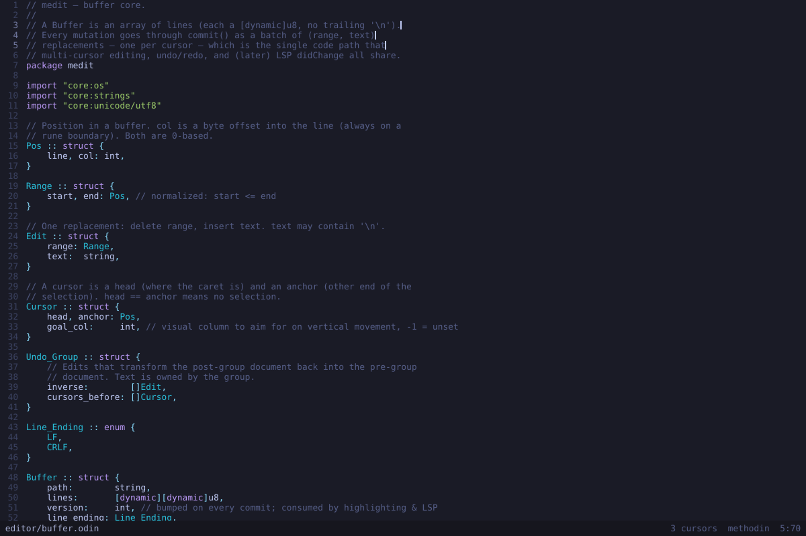

# medit — a tight little code editor, written in Methodin

A small, fast, GPU-rendered code editor that dogfoods the Methodin language:
the editor's own internals use in-struct procs and `impl` blocks throughout
(`Buffer.commit`, `App.select_next_match`, ...).



## What it does

- **Custom title bar** — no native window chrome: the tab bar doubles as the
  title bar, with a single × close button in the top-right corner (hovered
  red, native-style, the same on every platform), draggable empty space,
  and resizable window edges, all drawn by the editor itself. Closing with
  unsaved files takes a confirming second attempt. UI chrome (tabs, file
  tree, status bar, panel titles) renders in the system's proportional UI
  font (`MEDIT_UI_FONT` overrides); the buffer stays monospace. The chrome
  icons (chevrons, file/folder, search, the debugger controls, ×) come from
  the [Lucide](https://lucide.dev) icon font, vendored under `vendor/lucide/`
  (ISC license) and compiled into the binary.
- **Tabs** — every file opens in its own tab with its own undo history,
  cursors, scroll position and selection history. Click to switch, `×` or
  middle-click to close (a dirty file shows a dot instead of `×`, and closing
  it takes a confirming second attempt), right-click for the file context
  menu, mouse wheel to scroll an overflowing tab bar. `ctrl+tab` /
  `ctrl+shift+tab` (also `ctrl+pgup/pgdn`) cycle, `ctrl+1..9` jump,
  `ctrl+w` closes. Go-to-definition and find-usages open their targets in
  tabs too, and an LSP rename touching a file that is open in another tab
  edits that buffer (undoable) instead of clobbering it on disk. Closing the
  window with unsaved files anywhere also takes a second attempt.
- **Command palette** — `ctrl+p`, vscode-style. Fuzzy file finder by default
  (`/` and `\` are interchangeable, matches highlighted, filename hits ranked
  first); prefix `>` for app commands and settings (`ctrl+shift+p` jumps
  straight there), `/term` for live document search (`ctrl+f`, up/down hops
  between matches, esc restores the view), `:line[:col]` to jump,
  `!` for the LSP document outline (`ctrl+e`) and `#` for workspace symbol
  search (`ctrl+t`) — both with kind badges and live preview. Previews of
  results in other files open them in a single transient preview tab: enter
  keeps it as a real tab, esc drops it and restores where you were. Modes are
  a table in `palette.odin` — a new one is a prefix plus refresh/accept/preview
  procs.
  The context menu (`ctrl+.`, or right-click) is a palette mode too: actions
  for the current selection or symbol (select all occurrences, search, case
  transforms, ...), or for a file or directory when triggered on the sidebar
  (empty space targets the workspace root) or a palette file item: open,
  new file/folder, rename, delete (enter twice — the menu re-arms as a
  confirm), show in the system file manager, copy absolute/relative
  path or name. New-file/folder and rename names are typed straight into
  the palette input.
- **LSP** — go to definition (`ctrl+g` / ctrl+click), find usages (`ctrl+h` /
  ctrl+shift+click, results in the palette with live preview), rename symbol
  (`F2`; edits to the current buffer are undoable, other files are updated on
  disk), and hover: rest the mouse on a symbol to get its signature/type in
  a tooltip (markdown code blocks rendered bright, prose dim). Autocomplete
  pops up as you type identifiers and after `.` (fields, procs, methods —
  fuzzy-filtered client-side, tab/enter accepts at every cursor, `ctrl+space`
  to summon); typing `(` or `,` shows the call's signature with the current
  argument highlighted, tracking as you type. Talks to [Methodin-ols](https://github.com/kebabskal/Methodin-ols)
  for `.odin` files — found automatically in a `Methodin-ols` (or `ols`)
  checkout next to any ancestor of the working directory, else `ols` on
  PATH; `MEDIT_OLS` overrides. `>LSP: Restart Language Server` after
  installing it mid-session.
  Other languages are one case in `lsp_server_exe` (`lsp.odin`). The client
  is thread-free: JSON-RPC over stdio, polled from the main loop.
- **File tree sidebar** — the working directory as a lazily-loaded tree
  (`ctrl+b` to toggle). Click a directory to expand it, a file to open it
  (in its existing tab if it already has one); right-click anything (or the
  empty space, for the workspace root) for the file context menu — create,
  rename and delete files and folders from there. The tree re-reads its
  expanded directories after every save and whenever the window regains
  focus, so files created elsewhere show up on their own; collapsing and
  re-expanding a directory still force-refreshes it.
- **Tasks (run / debug)** — `ctrl+r` runs the project: the default (first)
  task from `.medit/tasks.ini`, restarting whatever is already running; with
  no config yet it creates one from a template and opens it. `ctrl+shift+r`
  (or `$` in the palette) picks a task by name. Each `[section]` is a task
  with a `cmd` and an optional `cwd`; `${file}`, `${fileName}`, `${fileDir}`
  and `${workspaceFolder}` expand before the command runs. Output
  (stdout+stderr) streams into a panel above the status bar; file references
  in it (`main.odin(9:8)`, `src/foo.c:12:5`) are underlined and click
  straight to the spot, and the exit code lands in the title and status bar.
  While a task runs, a spinner with its name sits in the status bar and the
  panel header grows a `kill` button (`close` hides the panel).
- **Debugging (DAP)** — breakpoints, stepping and runtime-error stops via
  the Debug Adapter Protocol (`lldb-dap` on PATH by default, `MEDIT_DAP`
  overrides — the same stdio-JSON shape as the LSP client). A task with
  `debug = true` and `program = path` builds (its `cmd`) and then launches
  the program under the adapter. `F9` (or a click in the gutter) toggles a
  breakpoint, `F5` continues or starts the debug task, `F10`/`F11`/
  `shift+F11` step over/in/out, `shift+F5` stops — and while stopped the
  output panel header grows clickable `continue over in out` buttons next
  to `kill`. Stops highlight the line (marker in the gutter's breakpoint
  column), jump to it, and print the call stack (each frame a clickable
  file reference) plus the locals into the panel; hovering an expression
  in the source shows its runtime value. Panics and bounds-check traps
  stop like breakpoints, and program output arrives in the same panel.
  `odin_lldb.py` (next to the medit binary) teaches LLDB to render Odin
  strings as text and slices/dynamic arrays as their elements — use it from
  plain lldb (`command script import .../odin_lldb.py`); set
  `MEDIT_DAP_FORMATTERS=1` to auto-load it into debug sessions once your
  lldb-dap survives script imports (22.1.8 on Windows crashes on them).
- **Settings** — `>Settings: Open Settings` (user-wide, in the user config
  directory) and `>Settings: Open Project Settings` (`.medit/settings.ini`);
  both created from a template on first use, re-read on save, focus and
  workspace switch, and the project file adds to the user one. Currently:
  `[files] hide = *.exe *.pdb bin` — globs hidden from the file tree.
- **Multiple cursors** — `ctrl+alt+↑/↓` to stack cursors, `ctrl+d` to select
  the next occurrence, `alt+click` to add a cursor anywhere. Every editing
  action is a batch of `(range, text)` replacements, one per cursor, applied
  through a single code path shared with undo/redo (and, later, LSP
  `didChange`).
- **Syntax highlighting** — Methodin/Odin via `core:odin/tokenizer` (the
  compiler's own lexer, so it always agrees with the language), a
  data-driven generic lexer covering C, C++, Python, JavaScript, TypeScript,
  Rust, Go, Java, C#, Lua, shell, PowerShell, batch, YAML, TOML, INI, CSS,
  JSON, GLSL, HLSL and WGSL (a new language is a `Lex_Config` table entry),
  and small dedicated lexers for Markdown and HTML/XML. Language is guessed
  from the extension and overridable via `>language` in the palette.
  Whole-buffer relex on edit; plenty fast for real files.
- **Exact dirty tracking** — undo back to the saved state and the dirty
  marker goes away.
- **Cross platform** — SDL3 + OpenGL 3.3 + stb_truetype, all from this
  repo's `vendor/`. Linux, Windows, macOS. Finds a system monospace font
  automatically (`MEDIT_FONT=/path/to/font.ttf` to override).
- Smooth scrolling, drag / double-click-drag word selection, alt+drag column
  selection, smart home, auto-indent on enter, tab/shift+tab block (de)indent,
  move lines (`alt+↑/↓`), duplicate (`ctrl+shift+d`), toggle line comment
  (`ctrl+'`), multi-cursor-aware copy/cut/paste (N clipboard lines paste onto
  N cursors), selection undo (`ctrl+u`), system open/save dialogs, line
  numbers, current-line highlight, status bar.

## Build

Needs the Methodin compiler built at the repo root first
(`./build_odin.sh release`, or `build.bat release` on Windows).

```sh
editor/build.sh          # -> editor/medit
editor\build.bat         # -> editor\medit.exe (Windows)
```

On Linux/macOS the stb static libs must exist once:
`make -C vendor/stb/src` (build.sh does this for you). On Linux you also
need SDL3 (`libSDL3.so`) installed; on Windows `vendor/sdl3/SDL3.dll` ships
with the repo.

Run it:

```sh
editor/medit path/to/file.odin   # open a file
editor/medit path/to/project     # open a directory as the workspace
editor/medit                     # workspace = current directory
```

The sidebar, the ctrl+p file finder and the language server all root at the
workspace directory. `>File: Open Folder…` in the palette switches workspace
at runtime (the current buffer survives the move).

## Keys

| | |
|---|---|
| `ctrl+alt+↑/↓` | add cursor above/below |
| `ctrl+d` | select word / add next occurrence |
| `alt+click` / `alt+drag` | add cursor / column selection |
| `ctrl+u` | undo last selection change |
| `esc` | one caret at the last cursor; then collapse selection |
| `alt+↑/↓` | move lines up/down |
| `ctrl+shift+d` | duplicate selection (or line) |
| `ctrl+'` | toggle line comment |
| `ctrl+←/→` | smart word move (subwords; toggleable to whole words) |
| `ctrl+.` / right-click | context menu (selection, symbol, or file) |
| `ctrl+g` / ctrl+click | go to definition |
| `ctrl+h` / ctrl+shift+click | find usages |
| `F2` | rename symbol |
| `ctrl+space` | trigger completion (auto on identifiers and `.`) |
| `home` | first non-blank ↔ column 0 |
| `ctrl+home/end` | start/end of file |
| `shift` + any movement | extend selection |
| `ctrl+z` / `ctrl+shift+z` / `ctrl+y` | undo / redo |
| `ctrl+x/c/v` | cut/copy/paste (no selection: whole line) |
| `tab` / `shift+tab` | indent / dedent selection |
| `ctrl+a` | select all |
| `ctrl+p` | command palette (files; `>` commands, `/` search, `:` goto) |
| `ctrl+shift+p` | command palette, commands mode |
| `ctrl+f` | search the document (prefills the selection) |
| `ctrl+e` | document outline (palette `!` mode) |
| `ctrl+t` | workspace symbol search (palette `#` mode) |
| `ctrl+m` | go to problem (palette `?` mode; `ctrl+shift+m` toggles the panel) |
| `ctrl++` / `ctrl+-` / `ctrl+0` | font size up / down / reset (also ctrl+wheel) |
| `ctrl+b` | toggle the file tree sidebar |
| `ctrl+r` / `ctrl+shift+r` | run default task (restart if running) / pick a task |
| `F9` / gutter click | toggle breakpoint |
| `F5` / `shift+F5` | continue (or start the debug task) / stop debugging |
| `F10` / `F11` / `shift+F11` | step over / into / out |
| `ctrl+n` | new untitled tab |
| `ctrl+o` | open file (system dialog) |
| `ctrl+s` | save (untitled: system save dialog) |
| `ctrl+w` | close tab (unsaved: press twice) |
| `ctrl+tab` / `ctrl+shift+tab` | next / previous tab (also `ctrl+pgup/pgdn`) |
| `ctrl+1..9` | jump to tab 1..9 |

`cmd` works as `ctrl` on macOS.

## Architecture (and what's next)

```
buffer.odin     line-array buffer, batched edits, undo/redo   (tested)
tabs.odin       multiple documents + tab bar (per-doc undo/cursors/scroll)   (tested)
filetree.odin   file tree sidebar (lazy directory nodes, open-on-click)
palette.odin    ctrl+p palette (mode registry: files / commands / search / goto / ...)
lsp.odin        LSP client (stdio JSON-RPC, polled; definition/references/rename/hover)
complete.odin   completion popup + signature help (active param highlighted)
highlight.odin  per-line span lexers (odin tokenizer + generic)
render.odin     GL 3.3 quad batch + stb_truetype atlas
app.odin        cursors, actions, mouse, drawing
main.odin       SDL3 window, event loop, keymap, clipboard
```

The renderer exposes exactly two primitives (`push_rect`, `push_glyph`), so
a terminal backend stays a realistic option. The LSP client covers
definition / references / rename today; the natural next steps on top of it
are completion, hover, and `publishDiagnostics` squiggles (notifications are
already received, just ignored), plus per-language server configs
(`glsl_analyzer`, `vscode-json-language-server`, ...).

Known limits, deliberately: no splits yet, undo is per-keystroke (not
coalesced), whole-buffer relex, glyph atlas covers ASCII + Latin-1 + common
punctuation (anything else renders as a box).
